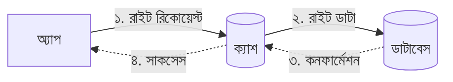
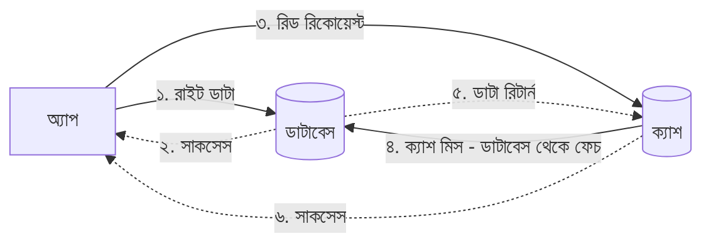
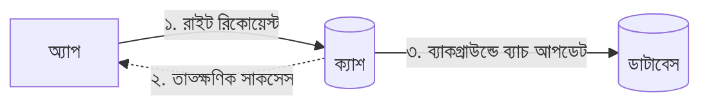
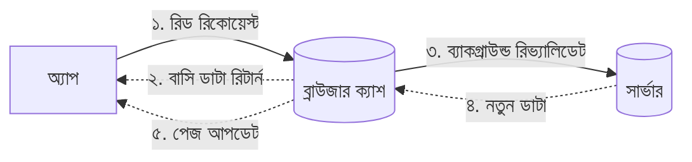

মন্টু এবার মোটামুটি সব বুঝে গেছে। কিন্তু তার মনে একটা খটকা থেকেই গেল। সে কিছু বলার আগেই বল্টু ভাই হাত তুলে থামিয়ে দিলেন।

— “বুঝেছি তুই কি বলবি। ক্যাশ তো সব ডাটা সেভ করে রাখল, কিন্তু মেইন ডাটাবেসে যদি ডাটা চেঞ্জ হয় (যেমন কেউ ভিডিওর টাইটেল এডিট করল), তখন ক্যাশ সেটা বুঝবে কীভাবে? সে তো ইউজারকে ওই পুরোনো টাইটেলই দেখাতে থাকবে! তাই না?”

মন্টু অবাক হয়ে বলল, — “জ্বি ভাই! আপনি বুঝলেন কী করে?”

বল্টু ভাই মুচকি হেসে বললেন, — “অভিজ্ঞতা রে পাগলা! সফটওয়্যার ইঞ্জিনিয়ারিংয়ে একটা বিখ্যাত উক্তি আছে: **'কম্পিউটার সায়েন্সে কঠিন কাজ মাত্র দুটো—এক হলো ভ্যারিয়েবলের নাম ঠিক করা, আর দুই হলো ক্যাশ ইনভ্যালিডেশন (Cache Invalidation)।'** মানে ক্যাশকে কখন আর কীভাবে আপডেট করতে হবে, যাতে ইউজার পচা বাসি ডাটা না দেখে—এটা ঠিক করা বেশ প্যারা। তবে ভয় পাস না, এর চমৎকার কিছু স্ট্র্যাটেজি আছে।”

আমাদের ক্যাশ সবসময় ফ্রেশ রাখার জন্য ডাটা রাইট (**Write**) বা আপডেট করার সময় কিছু বিশেষ টেকনিক ফলো করতে হয়। চল দেখে আসি সেগুলো কী কী:

### ১. রাইট থ্রু ক্যাশ (Write-Through Cache)

আমরা যে একটু আগে 'রিড থ্রু' দেখেছিলাম, এটা তার যমজ ভাই। এখানে ডাটা আপডেট করার সময় অ্যাপ একই সাথে **ক্যাশ** এবং **ডাটাবেস**—দুটোতেই আপডেট করে।

- **প্রসেস:** অ্যাপ প্রথমে ক্যাশে ডাটা আপডেট করে, তারপর ডাটাবেসে আপডেট করে। দুই কাজ শেষ হলে তবেই ইউজারকে 'Success' মেসেজ দেয়।
- **সুবিধা:** ডাটা ১০০% কন্সিস্টেন্ট থাকে। ক্যাশে যা আছে, ডাটাবেসেও তাই আছে।
- **অসুবিধা:** যেহেতু দুই জায়গায় লিখতে হচ্ছে, তাই ডাটা রাইট করতে সময় একটু বেশি লাগে (**High Latency**)।
- **উদাহরণ:** তোর বিড়ালটিউবে কেউ ভিডিওর টাইটেল চেঞ্জ করলে সেটা রাইট-থ্রু পদ্ধতিতে আপডেট করা ভালো, যাতে সবাই সাথে সাথে নতুন টাইটেল দেখে।

### ২. রাইট অ্যারাউন্ড ক্যাশ (Write-Around Cache)

নাম শুনেই বোঝা যাচ্ছে, এটা ক্যাশকে 'পাশ কাটিয়ে' বা বাইপাস করে চলে যায়।

- **প্রসেস:** অ্যাপ সরাসরি ডাটাবেসে ডাটা রাইট করে। ক্যাশে হাতই দেয় না। ফলে ক্যাশে থাকা পুরোনো ডাটাটা ইনভ্যালিড হয়ে যায়।
- **পরবর্তী ধাপ:** পরে যখন কেউ ওই ডাটা রিড করতে যায়, তখন 'ক্যাশ মিস' হয় (কারণ ক্যাশে ডাটা নেই বা পুরোনো)। তখন ক্যাশ আবার ডাটাবেস থেকে নতুন ডাটা এনে নিজেকে আপডেট করে নেয়।
- **সুবিধা:** যেই ডাটা খুব একটা রিড করা হয় না (যেমন লগস বা আর্কাইভ), সেগুলো ক্যাশে জায়গা নষ্ট করে না।
- **অসুবিধা:** ডাটা আপডেট করার ঠিক পরপরই যদি কেউ রিড করতে আসে, তাকে একটু ওয়েট করতে হয় (কারণ ক্যাশ মিস হয়)।

### ৩. রাইট ব্যাক ক্যাশ (Write-Back / Write-Behind Cache)

এটা হলো স্পিডের রাজা! এখানে অ্যাপ ইউজারের কাছ থেকে ডাটা নিয়ে শুধু ক্যাশে সেভ করে এবং সাথে সাথে ইউজারকে বলে দেয় "কাজ হয়ে গেছে!"। কিন্তু ডাটাবেসে তখনো সেভ হয়নি।

- **প্রসেস:** ক্যাশ নির্দিষ্ট সময় পর পর (যেমন প্রতি ১ মিনিটে) বা মেমরি ভরলে সব জমানো ডাটা একসাথে ডাটাবেসে রাইট করে (**Batch Update**)।
- **সুবিধা:** রাইট স্পিড সাংঘাতিক ফাস্ট! ডাটাবেসের ওপর চাপ অনেকটা ই কমে যায়।
- **উদাহরণ:** তোর ভাইরাল ভিডিওর সিনারিও। প্রতি সেকেন্ডে হাজার হাজার লাইক পড়ছে। তুই যদি প্রতিটা লাইক সরাসরি ডাটাবেসে লিখতে যাস, ডাটাবেস মরে যাবে। তার চেয়ে ক্যাশে লাইক কাউন্ট বাড়া, আর ১ মিনিট পর পর ডাটাবেসে টোটাল সংখ্যাটা আপডেট করে দে।
- **বড় ঝুঁকি:** যদি ১ মিনিটের মাথায় কারেন্ট চলে যায় বা সার্ভার ক্র্যাশ করে, তবে ওই ১ মিনিটের সব লাইক বা ডাটা কিন্তু গায়েব হয়ে যাবে! কারণ ওটা ডাটাবেসে সেভই হয়নি।

মন্টু মিয়াঁ মাথা নেড়ে একটু কনফিউশনের সুরে বললো, “আচ্ছা ভাই, যেই সিস্টেম সেইফ (Consistent), সেটার স্পিড কম। আর যেটার স্পিড ভালো, সেটার ডাটা হারানোর ভয় আছে। এমন কেন? অলরাউন্ডার কিছু কি নেই?”

বল্টু ভাই বললেন, “সিস্টেম ডিজাইনে **Trade-off** সবসময়ই থাকবে। সহজ কথায়, তুই কখনোই সব সুখ একসাথে পাবি না। স্পিড চাইলে ডাটার সেফটিতে একটু ছাড় দিতে হবে, আবার কড়া সেফটি চাইলে স্পিড একটু কমবে। ইঞ্জিনিয়ার হিসেবে তোকে ডিসিশন নিতে হবে তোর অ্যাপের জন্য কোনটা জরুরি।”

“তবে এগুলো তো গেলো ডাটা 'লেখার' নিয়ম। ক্যাশ থেকে পুরোনো ডাটা ডিলিট বা ইনভ্যালিড করার জন্য আরও কিছু পপুলার মেথড আছে। যেমন:”

### TTL (Time-To-Live) Expiration

তোর ক্যাশে যেকোনো কিছু রাখার আগে তুই যদি বলে দিস, “এই ডাটা ১ ঘণ্টার বেশি থাকবে না"। মানে এই ডাটার মেয়াদ (**TTL**) ১ ঘণ্টা। এই সময় পার হলেই ডাটা অটোমেটিক ক্যাশ থেকে ডিলিট হয়ে যাবে। এরপর কেউ চাইলে ক্যাশ আবার ডাটাবেস থেকে ফ্রেশ কপি এনে দেবে। এতে করে ক্যাশে পুরোনো ডাটা থাকলেও তা ১ ঘণ্টার বেশি বাসি হবে না।

### Stale-While-Revalidate (SWR)

এটা মেইনলি ফ্রন্টএন্ড বা ব্রাউজারের জন্য বেশি কাজে লাগে। ধর কেউ তোর প্রোফাইলে ঢুকল। অ্যাপ তাকে লোড হওয়ার জন্য বসিয়ে না রেখে, ব্রাউজারের ক্যাশে থাকা গতকালকের বাসি (**Stale**) প্রোফাইলটাই আগে দেখিয়ে দেবে। আর ব্যাকগ্রাউন্ডে চুপিসারে সার্ভার থেকে নতুন (**Revalidate**) ডাটা আনবে। নতুন ডাটা আসার পর টুপ করে পেজটা আপডেট করে দেবে। ইউজার ভাববে অ্যাপ তো সুপার ফাস্ট!

এছাড়া **Purge** (জোর করে ডিলিট করা) বা **Ban** এর মতো আরও পদ্ধতি আছে। তবে আপাতত তোর এটুকু জানলেই হবে।
