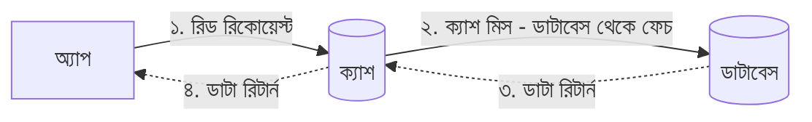
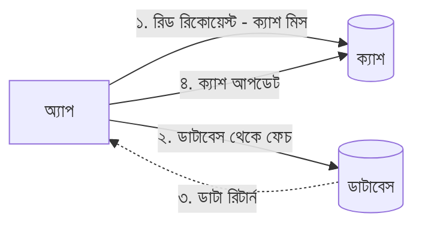

— "না রে বোকা! তোর কি এত সময় আছে যে বসে বসে ঠিক করবি কোনটা ক্যাশ হবে? আর তুই আগে থেকে বুঝবিই বা কী করে কোন ভিডিওটা ভাইরাল হবে? এই ক্যাশিং লেয়ার ডাটা কীভাবে পাবে, সেটার জন্য মেইনলি ২ ধরনের প্রসেস বা স্ট্র্যাটেজি আছে। চল দেখি।"

### ১. রিড থ্রু ক্যাশ (Read-Through Cache) - দয়ালু অ্যাসিস্ট্যান্ট

এই সিস্টেমে তোর অ্যাপ সবসময় ডাটা চাইবে ক্যাশের কাছে। অ্যাপ ডাটাবেসকে চিনবেও না।

- **প্রসেস:** অ্যাপ ক্যাশকে বলবে "ডাটা দাও"।
  - যদি ক্যাশে থাকে (**Cache Hit**): ক্যাশ সাথে সাথে ডাটা দিয়ে দেবে।
  - যদি না থাকে (**Cache Miss**): ক্যাশ নিজেই ডাটাবেসের কাছে গিয়ে ডাটা নিয়ে আসবে, নিজের কাছে এক কপি সেভ করবে এবং অ্যাপকে দেবে।
- **সুবিধা:** অ্যাপের কোড খুব সিম্পল থাকে। ডাটাবেস থেকে ডাটা আনার দায়িত্ব পুরোপুরি ক্যাশ প্রোভাইডারের।

### ২. রিড অ্যাসাইড ক্যাশ (Read-Aside / Cache-Aside) - অলস অ্যাসিস্ট্যান্ট

এটা সবচেয়ে জনপ্রিয় পদ্ধতি। এখানে ক্যাশ একটু অলস, তাকে সব বলে দিতে হয়।

- **প্রসেস:**
  - তোর অ্যাপ প্রথমে ক্যাশকে চেক করবে। ডাটা পেলে (**Hit**) ভালো, নিয়ে কাজ শেষ।
  - যদি না পায় (**Miss**), তাহলে অ্যাপ নিজেই ডাটাবেস থেকে ডাটা কুয়েরি করে আনবে।
  - ইউজারকে ডাটা দেখানোর পাশাপাশি, অ্যাপ নিজেই সেই ডাটা ক্যাশের মধ্যে সেভ করে দেবে, যাতে পরের বার কেউ চাইলে ক্যাশ থেকেই পায়।
- **সুবিধা:** এটা ইমপ্লিমেন্ট করা ফ্লেক্সিবল। ঠিক যেই ডাটা দরকার, শুধু সেটুকুই ক্যাশ করা যায়। এবং রেডিস বা মেমক্যাশড সাধারণত এই প্যাটার্নেই বেশি ব্যবহার করা হয়।

মন্টু সব শুনে বলল, “বুঝলাম! রিড-অ্যাসাইডই আমার জন্য বেটার মনে হচ্ছে। কিন্তু ভাই, র‍্যামে (RAM) তো জায়গা অনেক কম থাকে। যদি ক্যাশ মেমরি ভরে যায় তখন কী হবে? আরও র‍্যাম কিনে এনে লাগাতে হবে নাকি?”
